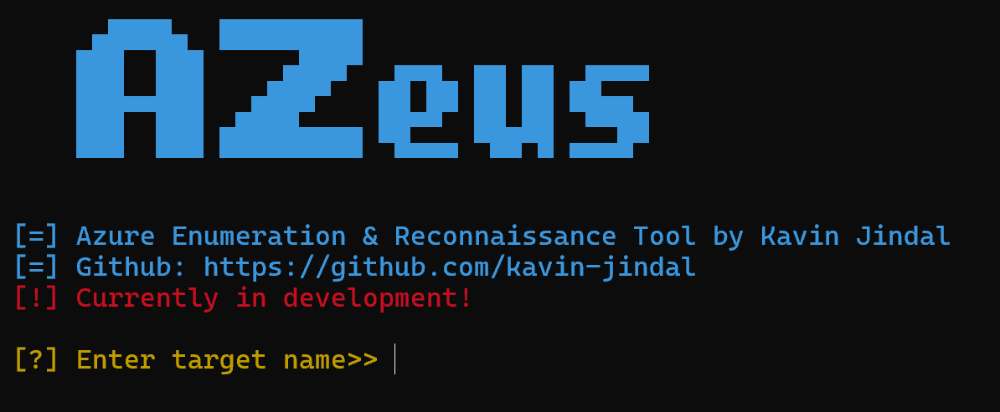
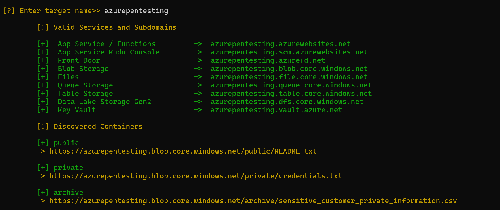

<div align="center">

# AZeus

**Azure Enumeration & Reconnaissance Tool**

[](https://www.python.org/)
[]()

 Fast, passive Azure infrastructure enumeration for cloud attack surface mapping.

</div>

---

**[!] IN DEVELOPMENT** AZeus is actively being built. The current release covers subdomain enumeration and public blob container discovery. More modules are on the way, see the [Roadmap](#roadmap).

**[!] DISCLAIMER** This tool is for authorized security testing, CTFs, and educational purposes only. Unauthorized enumeration may violate Microsoft's Terms of Service and applicable law. Always obtain explicit written permission before running AZeus against any target.

---

## Table of Contents

- [What is AZeus?](#what-is-azeus)
- [Current Features](#current-features)
- [Screenshots](#screenshots)
- [Installation](#installation)
- [Usage](#usage)
- [Roadmap](#roadmap)
- [Contributing](#contributing)

---

## [*] What is AZeus?

**AZeus** is a Python-based passive reconnaissance tool built specifically for **Azure cloud environments**. Given only a target name (e.g., a company or product name), AZeus systematically probes the Azure DNS namespace to discover live cloud services, exposed endpoints, and publicly accessible storage.

It's designed for:
- [+] **Penetration Testers** mapping an Azure attack surface
- [+] **Bug Bounty Hunters** looking for exposed Azure resources
- [+] **Security Researchers & Students** learning cloud security concepts

---

## [+] Current Features

### 1. Azure Subdomain Enumeration

AZeus checks **23 Azure service DNS suffixes** across every major Azure resource category to discover which services a target organisation is using.

| Category | Services Checked |
|---|---|
| **Compute & App Services** | Virtual Machines, App Service, Kudu Console, Container Instances, Container Registry, Front Door |
| **Storage** | Blob, Files, Queue, Table, Data Lake Gen2, Static Website |
| **Databases** | SQL Database, Cosmos DB, PostgreSQL, MySQL, Redis Cache |
| **Networking & Messaging** | Traffic Manager, Service Bus, Event Hubs, API Management |
| **Security** | Key Vault |
| **Identity & Management** | Microsoft Entra ID (formerly Azure AD), Resource Manager API |
| **Kubernetes** | AKS Control Plane, AKS Application Routing |

> [*] Only **live, resolvable** subdomains are printed. Dead ends are silently skipped.

---

### 2. Public Blob Container Discovery

If a Blob Storage endpoint is found (`<target>.blob.core.windows.net`), AZeus automatically pivots into **container enumeration mode**:

- Iterates through a curated **127-word container wordlist** (`wordlist.txt`) targeting common container naming patterns like `backups`, `credentials`, `secrets`, `logs`, `exports`, and more.
- Probes each container using the Azure Blob Storage REST API (`?restype=container&comp=list`).
- **Lists all blobs** inside any publicly accessible container, displaying their direct URLs for immediate inspection.

Just a target name.

---

## [*] Screenshots

**Banner & startup:**



**Subdomain enumeration + public blob container discovery:**



---

## [>] Installation

**Prerequisites:** Python 3.10 or higher

```bash
# Clone the repository
git clone https://github.com/yourusername/AZeus.git
cd AZeus

# Install dependencies
pip install -r requirements.txt
```

---

## [>] Usage

```bash
# Subdomain & service enumeration only (default)
python main.py -t contoso

# Positional argument also supported
python main.py contoso

# Enumerate containers only (skips subdomains)
python main.py -t contoso -c

# Use a custom wordlist for container discovery
python main.py -t contoso -c -w path/to/wordlist.txt

# Test a single specific container directly
python main.py -t contoso --container backups

# Enumerate BOTH subdomains and containers
python main.py -t contoso --all

# Suppress banner (quiet mode)
python main.py -t contoso --no-banner
```

### CLI Options

| Flag | Argument | Description |
|---|---|---|
| `-h`, `--help` | | Show help message and exit |
| `-t`, `--target` | `TARGET` | Target name / organization prefix (e.g., `contoso`) |
| `TARGET` | | Positional fallback for target name |
| `-c`, `--containers` | | Enumerate public Blob Storage containers only (skips subdomain scan) |
| `--container` | `NAME` | Check a single specific container name for public access |
| `-w`, `--wordlist` | `PATH` | Custom wordlist path for container discovery (default: `wordlist.txt`) |
| `--all` | | Enumerate both subdomains and containers |
| `--no-banner` | | Suppress the ASCII art banner |

**Example output:**

```
[!] Valid Services and Subdomains

[+] Blob Storage                        ->  contoso.blob.core.windows.net
[+] App Service / Functions             ->  contoso.azurewebsites.net

[!] Discovered Containers

[+] backups
     > https://contoso.blob.core.windows.net/backups/db_dump_2024.sql
     > https://contoso.blob.core.windows.net/backups/config.env

[+] exports
     > https://contoso.blob.core.windows.net/exports/users.csv
```

Press `Ctrl+C` at any time to exit cleanly.

---

## [>] Roadmap

The following modules are **planned for future releases**:

- [ ] **Microsoft Entra ID (Azure AD) tenant info gathering** (tenant ID, federation metadata, user enumeration)
- [ ] **Azure Container Registry enumeration** (discover public image repositories)
- [ ] **Azure Static Website content discovery** (crawl `.web.core.windows.net` endpoints)
- [ ] **Key Vault secret name enumeration** (unauthenticated metadata)
- [ ] **API Management endpoint discovery**
- [ ] **AKS / Kubernetes API server probing**
- [ ] **JSON / HTML report export**
- [ ] **Multi-threaded scanning** for faster enumeration
- [x] **Custom wordlist support** via CLI flags
- [x] **CLI argument mode** (`argparse`) to remove interactive prompts

---

## [>] Contributing

Contributions, ideas, and feedback are welcome! AZeus is in early development and there's a lot of ground to cover.

1. Fork the repository
2. Create a feature branch (`git checkout -b feature/my-feature`)
3. Commit your changes (`git commit -m 'Add my feature'`)
4. Push to the branch (`git push origin feature/my-feature`)
5. Open a Pull Request

---

## [!] Legal Disclaimer

AZeus is provided **for educational and authorized testing purposes only**. The author is not responsible for any misuse. Always ensure you have **explicit written permission** before conducting any reconnaissance or security testing on systems you do not own.

---

<div align="center">

Made by **Kavin Jindal**

</div>
